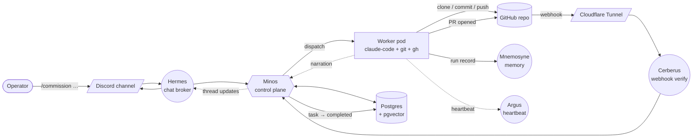

# Project Daedalus

An AI agent orchestrator. Commission a coding task from a chat surface, and a sandboxed agent clones the repo, does the work, and opens a pull request. The control plane never writes code — it dispatches agents that do, and gets out of their way.

> **Agents build. Infrastructure isolates. Humans approve.**

## What it does



Each task is:

- **Sandboxed** — own pod, own filesystem, one feature branch. No shared state between agents.
- **Auditable** — every state transition, pod heartbeat, and credential use recorded in Postgres.
- **Disposable** — pods die when the work is done. The control plane holds no long-lived agent state.
- **Human-approved** — the PR is the gate. Nothing ships to main without a merge.

## The pieces

Named for the Minotaur myth — Minos commissioned Daedalus to build the labyrinth.

| Daemon        | Role                                                       |
| ------------- | ---------------------------------------------------------- |
| **Minos**     | Control plane. Commissions tasks, dispatches pods, tracks state, hibernates stale work. |
| **Hermes**    | Chat-surface broker. One plugin per surface (Discord today). |
| **Cerberus**  | Guardian of the webhook gate. Verifies GitHub deliveries and drives task state transitions. |
| **Mnemosyne** | Memory store. pgvector-backed run records + semantic context for future tasks. |
| **Argus**     | Watchful eye. Per-pod heartbeat tracking and abandonment sweeper. |
| **Iris**      | LLM responder for chat-driven Q&A (Phase 2). |
| **Apollo**    | External-LLM broker with spend + rate governance (Phase 2). |
| **Hecate**    | Credentials broker with JWT-gated fetches and in-pod refresh (Phase 2). |
| **Asclepius** | Health and drift detection across the broker fleet (Phase 3). |
| **Athena**    | Local inference substrate + development sandboxes (Phase 3). |

Worker pods ship a [`claude-code`](agents/claude-code) image. The AI inference itself is Anthropic's Claude, authenticated via OAuth against the operator's subscription rather than a metered API key.

## Current state — Phase 1 (MVP)

**Phase 1 is complete and verified end-to-end on a real Proxmox cluster.** Posture: **single operator, single project, single surface (Discord), single private repo with trusted contributors.** Everything beyond that is Phase 2+.

From a fresh Terraform apply, the deploy runbook takes you to a working system in ~20 minutes of mostly-unattended scripts:

- 4 guests provisioned on an internal VLAN (Postgres LXC + 3 VMs)
- Postgres 17 + pgvector, schema migrated across four schemas (minos, argus, mnemosyne, iris)
- k3s on labyrinth with worker images loaded into containerd
- Minos daemon wired to Discord, GitHub webhooks via Cloudflare Tunnel, and an injected-credential path to Anthropic + GitHub
- Real `/commission` in Discord → real pod on labyrinth → real PR opened → real `pr-merged` webhook → task transitions to `completed` in Postgres, all visible in a Discord thread

See [`deploy/README.md`](deploy/README.md) for the 8-step runbook and the tear-down-and-rebuild procedure.

### Known Phase 1 constraints (by design, not bugs)

- HMAC bearer tokens for pod auth (Ed25519 JWT shape is prepared, swap is Phase 2).
- Single admin, hardcoded in config.
- Single project, hardcoded in config.
- Claude OAuth token is deployment-scoped — every pod uses the operator's subscription. Spend cap is enforced at the Anthropic console, not by Daedalus.
- GitHub PAT for worker push. Phase 2 replaces with short-lived GitHub App installation tokens.
- File-backed secret provider, push-only; in-pod credential refresh is Phase 2 (Hecate).
- Postgres LXC is a single point of failure — its loss quietly stalls the control plane. Phase 3 Asclepius adds Daedalus-native alerting; for now it's a homelab-operations concern.

## Roadmap

The [full roadmap](docs/roadmap.md) is the authoritative source; this is the shape at a glance.

### Phase 2 — Broker layer + pod-class expansion + hardening

Triggered when a second surface, second project, or second admin becomes real — whichever comes first. Not a calendar release; it's pull-based.

- **Broker extraction** — Hermes surface plugins move to subprocesses (Slack and Teams plugins land once the multi-identity abstraction ships — pods speak as Iris/Minos/Asclepius in threads, not all as "Hermes"). Cerberus becomes a real pluggable broker with more than one verifier. Apollo centralizes external-LLM calls with spend + rate governance. Hecate fronts the secret provider with JWT-authenticated fetches and in-pod credential refresh. Argus extracts into its own service with signed audit ingest from every broker.
- **Pod-class expansion** — Iris-as-pod with local inference (Ollama). Pythia research pods. Infra (Proxmox/Terraform) pods via a Proxmox MCP broker.
- **Identity & auth hardening** — Ed25519 JWTs replace HMAC bearers everywhere. Multi-admin and multi-project registries. Per-project capability composition.
- **Trust boundary tightening** — source tagging on untrusted PR feedback, Mnemosyne cross-run injection tolerance, sanitization expansion.

### Phase 3 — Expansion

- **Asclepius** — broker health and drift detection, Daedalus-native alerting, recovery orchestration.
- **Athena Development Sandboxes** — per-sandbox users, allocated port ranges, MCP-driven lifecycle. Depends on Calico + NetworkPolicy layering (also Phase 3).
- Additional surfaces (Telegram, Matrix) as they appear.

## Repo layout

```
cmd/minos, cmd/minosctl  · daemon + operator CLI
minos/                   · orchestration core, dispatch, task store, Argus sidecar
hermes/                  · chat-surface broker + plugins
cerberus/                · webhook verification + replay store
mnemosyne/               · memory store (postgres + pgvector)
agents/                  · worker pod images + sidecars
pkg/                     · shared libs (envelope, jwt, audit, providers)
schemas/                 · envelope JSON schema
terraform/               · Proxmox guest provisioning
deploy/                  · bootstrap scripts for Postgres, k3s, Minos, Cloudflared
docs/                    · architecture, roadmap, security, build-vs-adopt notes
```

## Deeper reading

- [`docs/architecture.md`](docs/architecture.md) — full component taxonomy, envelope spec, recovery semantics
- [`docs/roadmap.md`](docs/roadmap.md) — phase boundaries and delivery scope (authoritative)
- [`docs/phase-1-plan.md`](docs/phase-1-plan.md) — the slice decomposition that shipped
- [`docs/security.md`](docs/security.md) — threat model + verification paths
- [`docs/build-vs-adopt.md`](docs/build-vs-adopt.md) — what we could adopt vs build
- [`deploy/README.md`](deploy/README.md) — operational runbook

## Status

Active development. Phase 1 functional; Phase 2 planning underway.
