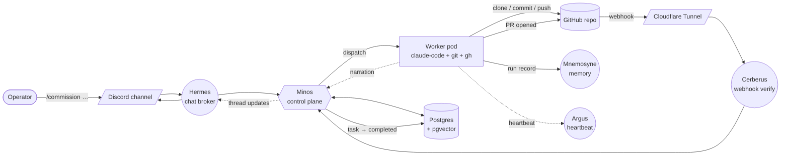

# Project Zakros

An AI agent orchestrator. Commission a coding task from a chat surface, and a sandboxed agent clones the repo, does the work, and opens a pull request. The control plane never writes code — it dispatches agents that do, and gets out of their way.

> **Agents build. Infrastructure isolates. Humans approve.**

## What it does


```mermaid
flowchart LR
    Op([Operator])
    Discord[/Discord channel/]
    Hermes((Hermes<br/>chat broker))
    Minos{{Minos<br/>control plane}}
    Pod[Worker pod<br/>claude-code + git + gh]
    Repo[(GitHub repo)]
    PG[(Postgres<br/>+ pgvector)]
    Tunnel[/Cloudflare Tunnel/]
    Cerberus((Cerberus<br/>webhook verify))
    Mnemo((Mnemosyne<br/>memory))
    Argus((Argus<br/>heartbeat))

    Op -- "/commission …" --> Discord
    Discord --> Hermes --> Minos
    Minos -- dispatch --> Pod
    Pod -- clone / commit / push --> Repo
    Pod -- "PR opened" --> Repo
    Pod -. narration .-> Minos -. thread updates .-> Hermes --> Discord
    Pod -- "run record" --> Mnemo
    Pod -. heartbeat .-> Argus
    Minos <--> PG
    Repo -- webhook --> Tunnel --> Cerberus --> Minos
    Minos -- "task → completed" --> PG
```

Each task is:

- **Sandboxed** — own pod, own filesystem, one feature branch. No shared state between agents.
- **Auditable** — every state transition, pod heartbeat, and credential use recorded in Postgres.
- **Disposable** — pods die when the work is done. The control plane holds no long-lived agent state.
- **Human-approved** — the PR is the gate. Nothing ships to main without a merge.

## The pieces

Named for the Minoan palace site at Kato Zakro. Component names are drawn from the Minotaur myth — Minos commissioned Daedalus to build the labyrinth.

| Daemon        | Role                                                       |
| ------------- | ---------------------------------------------------------- |
| **Minos**     | Control plane. Commissions tasks, dispatches pods, tracks state, hibernates stale work. |
| **Hermes**    | Chat-surface broker. One plugin per surface (Discord today). |
| **Cerberus**  | Guardian of the webhook gate. Verifies GitHub deliveries and drives task state transitions. |
| **Mnemosyne** | Memory store. pgvector-backed run records + semantic context for future tasks. |
| **Argus**     | Watchful eye. Per-pod heartbeat tracking and abandonment sweeper. |
| **Iris**      | Conversational interface pod — NL commissions and state queries from chat (shipped; inference routed through Apollo). |
| **Apollo**    | External-LLM broker — all pod Anthropic traffic proxies through it; no pod holds the provider credential (H2a shipped; rate/spend enforcement is H2b). |
| **Hecate**    | Credentials broker on OpenBao — JWT-gated fetches, per-credential policies, in-pod refresh (shipped). |
| **Asclepius** | Health and drift detection across the broker fleet (Phase 3). |
| **Athena**    | Local inference appliance (Swift/MLX, Anthropic-dialect `/v1/messages`) — live as a homelab host; Zakros integration is Phase 3. |

Worker pods ship a [`claude-code`](agents/claude-code) image. The AI inference itself is Anthropic's Claude, authenticated via OAuth against the operator's subscription rather than a metered API key.

## Hardware

Zakros runs on two physical hosts in this homelab. The architecture is not bound to these specific devices — see [`docs/environment.md`](docs/environment.md) for the contract each host must satisfy.

| Host       | Role                                  | Specs |
| ---------- | ------------------------------------- | ----- |
| **Crete**  | Hypervisor for Zakros VMs + LXC     | Minisforum MS-01 · Intel i9-13900H · 96 GB DDR5 · 2× 1 TB NVMe (ZFS mirror) + third M.2 reserved · 2× 2.5 GbE + 2× 10 GbE · Proxmox VE 9.x |
| **Athena** | Local inference oracle (Phase 3 role) | Mac Studio M4 Max (Z1CD9LL/A) · 40-core GPU · 48 GB unified memory · 1 TB internal · macOS / launchd |

### Why a dedicated Crete host

Worker pods execute LLM-driven code with network access and write privileges on a feature branch. The blast radius of a misbehaving or compromised pod has to terminate at a boundary the agent cannot cross — and shared infrastructure doesn't give you one.

- **Hypervisor-level isolation between control plane and workers.** Minos (which holds credentials and dispatch authority) runs on a separate VM from Labyrinth (which runs the k3s cluster where pods execute). A pod escape stops at the Labyrinth VM boundary; it does not reach Minos's credential injection path or Postgres directly.
- **Per-guest egress allowlist enforced by the Proxmox firewall.** Each VM has its own vNIC-level rules — Minos, Labyrinth, Postgres, and Clio each get only the egress they need. Self-contained on Crete; does not depend on the homelab edge firewall for Zakros isolation.
- **Internal traffic never leaves the host.** Minos ↔ Labyrinth, Minos ↔ Postgres, Minos ↔ Clio all traverse Proxmox virtual bridges. There is no path for those flows to be observed or intercepted on the physical network.
- **Fast, local rollback.** Proxmox snapshots on a ZFS mirror let the operator revert a guest in seconds without coordinating with shared storage or other tenants.
- **Capacity headroom that won't get reclaimed.** Phase 1 footprint is ~32 GB RAM / 10 vCPU; the box has substantial unused capacity reserved for Phase 2/3 growth (Apollo, Hecate, Charon, Asclepius) without contending with unrelated workloads.

Athena is planned to grow into an M5 Ultra Mac Studio cluster interconnected over Thunderbolt 5 with RDMA (macOS 26.2+) to scale inference capacity without changing its architectural contract.

## Current state

**Phase 1 is complete and verified end-to-end on a real Proxmox cluster**, and five Phase 2 slices are committed: F (Ed25519 JWTs + github-broker), G (identity + project registries), J (Argus extraction + Cerberus verifier plugins), H1 (Hecate on OpenBao), and H2a (Apollo transparent proxy). Posture: **single operator, single project, single surface (Discord).** The Crete deployment is temporarily offline for a homelab remodel, so slices landed since the last rebuild hold at "committed, not acceptance-smoked."

From a fresh Terraform apply, the deploy runbook takes you to a working system in ~20 minutes of mostly-unattended scripts:

- 5 guests provisioned on an internal VLAN (Postgres + OpenBao LXCs, 3 VMs)
- Postgres 17 + pgvector, schema migrated across four schemas (minos, argus, mnemosyne, iris)
- k3s on labyrinth with worker images loaded into containerd
- Minos daemon wired to Discord and GitHub webhooks via Cloudflare Tunnel; broker fleet (github-broker, argus, hecate, apollo) under systemd; credentials pulled from OpenBao via Hecate, Anthropic traffic proxied by Apollo
- Real `/commission` in Discord → real pod on labyrinth → real PR opened → real `pr-merged` webhook → task transitions to `completed` in Postgres, all visible in a Discord thread

See [`deploy/README.md`](deploy/README.md) for the 8-step runbook and the tear-down-and-rebuild procedure.

### Known constraints (by design, not bugs)

- Apollo logs usage for visibility but does not yet enforce budgets or rate limits — that is H2b. Until then the Anthropic console spend cap is the outer cost boundary.
- Prompt-injection defenses (trust-boundary primitive, confirmation tokens, Mnemosyne untrusted-source tagging) are Slice K — not yet built.
- One operator in practice: the identity registry (Slice G) supports multiple identities and roles, but the deployment runs with a single admin row.
- Apollo authenticates to Hecate with a long-lived service JWT (H2a single-tenant simplification; ADR-recorded, revisited in H2b/K).
- Postgres LXC is a single point of failure — its loss quietly stalls the control plane. Phase 3 Asclepius adds Zakros-native alerting; for now it's a homelab-operations concern.

## Roadmap

The [full roadmap](docs/roadmap.md) is the authoritative source; this is the shape at a glance.

### Phase 2 — Broker layer + pod-class expansion + hardening

In progress. Full slice decomposition in [`docs/phase-2-plan.md`](docs/phase-2-plan.md); scope per [ADR 0003](docs/decisions/0003-phase-2-tail-is-re-derived-from-roadmap-triggers.md):

**Landed** — Slice 0 (Iris pod), F (Ed25519 JWTs + github-broker; replaced HMAC bearers and the PAT), G (identity + project registries), J (Argus extraction + Cerberus verifier plugins), H1 (Hecate on OpenBao), H2a (Apollo transparent Anthropic proxy — no pod holds the provider credential).

**Committed core, in order:**

- **H2b** — Apollo enforcement: per-project rate limits, non-forgeable usage events to Argus, runaway termination
- **Slice K** — trust-boundary primitive, high-blast confirmation tokens bound to operation content, Mnemosyne untrusted-source tagging
- **Slice L1** — Themis project-management pod; backlog decomposition and Argus escalation routing
- **Slice L2** — Momus PR-review pod (comment-only scope), reviewing Zakros's own PRs first

**Trigger-attached options** (built when their trigger fires, not before): Calliope, Prometheus, Hephaestus pods; the Slack plugin; admin UI + break-glass minting; Proxmox broker + `infra` tasks. Triggers are named in the roadmap and phase-2 plan.

Teams plugin, Athena dev sandboxes, Pythia research pods, and Asclepius health monitoring are Phase 3.

### Phase 3 — Expansion

- **Asclepius** — broker health and drift detection, Zakros-native alerting, recovery orchestration.
- **Athena Development Sandboxes** — per-sandbox users, allocated port ranges, MCP-driven lifecycle. Depends on Calico + NetworkPolicy layering (also Phase 3).
- Additional surfaces (Telegram, Matrix) as they appear.

## Repo layout

```
cmd/minos, cmd/minosctl  · daemon + operator CLI
cmd/argus                · extracted watcher service (Slice J)
cmd/github-broker        · GitHub App token broker (Slice F)
cmd/hecate               · credentials broker on OpenBao (Slice H1)
cmd/apollo               · external-LLM broker, transparent Anthropic proxy (Slice H2a)
minos/                   · orchestration core, dispatch, task store, Argus sidecar
hermes/                  · chat-surface broker + plugins
cerberus/                · webhook verification + replay store, verifier plugins
mnemosyne/               · memory store (postgres + pgvector)
agents/                  · worker pod images + sidecars (claude-code, iris)
pkg/                     · shared libs (envelope, jwt, brokerauth, audit, providers)
schemas/                 · envelope JSON schema
terraform/               · Proxmox guest provisioning
deploy/                  · bootstrap scripts for Postgres, k3s, Minos, brokers, OpenBao
docs/                    · architecture, roadmap, security, decisions/ (ADRs)
```

## Deeper reading

- [`docs/architecture.md`](docs/architecture.md) — full component taxonomy, envelope spec, recovery semantics
- [`docs/roadmap.md`](docs/roadmap.md) — phase boundaries and delivery scope (authoritative)
- [`docs/phase-1-plan.md`](docs/phase-1-plan.md) — the slice decomposition that shipped
- [`docs/phase-2-plan.md`](docs/phase-2-plan.md) — the Phase 2 slice decomposition
- [`docs/security.md`](docs/security.md) — threat model + verification paths
- [`docs/build-vs-adopt.md`](docs/build-vs-adopt.md) — what we could adopt vs build
- [`deploy/README.md`](deploy/README.md) — operational runbook

## Status

Active development. Phase 1 shipped and verified; Phase 2 in progress — slices F, G, J, H1, H2a landed, committed core H2b → K → L1 → L2 next ([ADR 0003](docs/decisions/0003-phase-2-tail-is-re-derived-from-roadmap-triggers.md)). Crete deployment offline pending homelab remodel.
